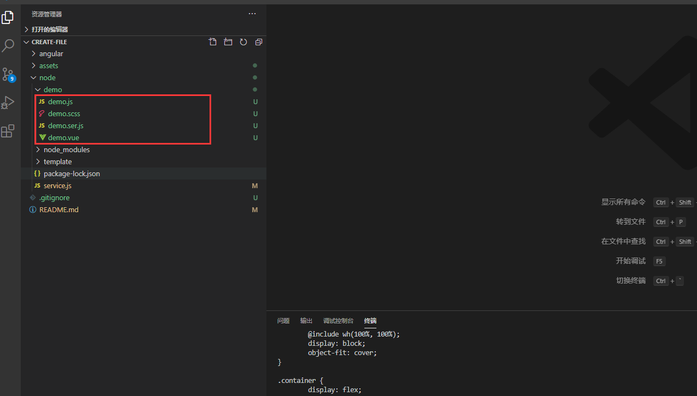

# create-file
这个工具的目的是原因是uniapp搭建业务目录,我觉得很麻烦,就造了个小轮子创建
因为node和angular掌握的不是很熟练,就用这两个练练手

## How to run it

### frontend
- Clone the project

```bash
  git clone https://github.com/chongchongLin/create-file.git
```

- Go to the project directory

```bash
  cd angular
```

- Install dependencies

```bash
  npm install
```

### service


- Go to the project directory

```bash
  cd node
```

- Install dependencies

```bash
  npm install
```

## result



